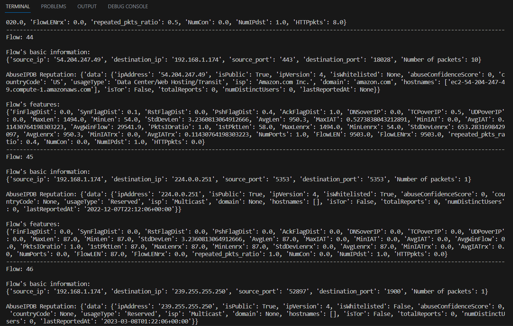

# Machine Learning Network Intrusion Detection System (NIDS) 

## mta-kdd-19 Branch

The mta-kdd-19 branch of this project focuses on building a Network Intrusion Detection System (NIDS) using the mta-kdd-19 dataset. It is designed to classify network traffic as either malicious or normal, providing insights into potential security threats in a network environment. This branch includes various functionalities and capabilities, as described below.

## Overview
The main objective of the mta-kdd-19 branch is to detect malicious network traffic and classify it accordingly. It utilizes the mta-kdd-19 dataset, which contains network traffic data, to train a Random Forest model. The trained model is capable of analyzing network traffic patterns and identifying potential attacks.

## Project Structure
The project structure for the mta-kdd-19 branch is as follows:

- **capture folder**: Contains the `capture_traffic.py` script, which can be used to capture network traffic for analysis.

- **dataset folder**: Contains the mta-kdd-19 dataset files (2 CSV files) for training the NIDS. Additionally, it includes the following scripts:
  - `rf_kdd_training.py`: This script performs the training of the Random Forest model using the mta-kdd-19 dataset.
  - `feature_importance.py`: This script calculates the feature importance scores using the trained Random Forest model.
  - `features_corr.py`: This script calculates the correlation between different features in the dataset.
  - `inf_gain.py`: This script calculates the information gain of each feature in the dataset.
  - `rfe.py`: This script performs Recursive Feature Elimination (RFE) to select the most important features for training the model.

- **traffic_analysis folder**: Contains the following files:
  - `config.ini`: This configuration file stores necessary settings for the NIDS, including the API key for IP reputation checkup.
  - `IDS.py`: This script implements the Network Intrusion Detection System (NIDS), which classifies network traffic and performs IP reputation checkup.

- **main.py**: This is the entry point of the application. It coordinates the execution of the various scripts and functions within the mta-kdd-19 branch.

## Functionalities and Capabilities

The mta-kdd-19 NIDS branch provides the following functionalities and capabilities:

1. **Network Traffic Classification**: The NIDS uses the trained Random Forest model to classify network traffic as either malicious or normal. It analyzes the features of network packets and determines if they correspond to any known attack patterns.

2. **IP Reputation Checkup**: The NIDS includes the ability to perform IP reputation checkup. It utilizes an API key, which should be provided in the `config.ini` file, to query IP reputation databases and assess the reputation of IP addresses involved in network traffic.

## Getting Started

To run the NIDS project using the mta-kdd-19 branch, follow these steps:

1. Ensure you have Python installed (Python 3.7 or higher recommended).

2. Clone the repository and navigate to the mta-kdd-19 branch.

3. Activate the virtual environment:
  - Open a terminal or command prompt.
     - Activate the virtual environment:
       - On Windows:
         ```
         .\venv\Scripts\activate
         ```
       - On macOS and Linux:
         ```
         source venv/bin/activate
         ```
4. Set up the configuration file:
- Open the `config.ini` file in the `traffic_analysis` folder.
- Insert your API key (AbuseIPDB) for IP reputation checkup in the appropriate field.

5. Train the Random Forest model:
- Run the `rf_kdd_training.py` script in the `dataset` folder.
- This script will train the Random Forest model using the mta-kdd-19 dataset.

6. Perform network traffic analysis:
- Run the `main.py` script.
- This script will capture network traffic using the `capture_traffic.py` script and analyze it using the trained model.
- Press Ctrl+C to stop the capture and wait for the results.


## unsw_nb15 Branch

The `unsw_nb15` branch uses the `unsw_nb15` dataset for network traffic classification. It extends the functionalities of the `mta-kdd-19` branch by predicting the attack category of malicious flows and includes an unsupervised learning approach using the Isolation Forest algorithm.

### Additional Features

- Multi-category Classification: Predicts the attack category of each malicious flow.
- Isolation Forest: Implements an unsupervised learning method for anomaly detection.
- Visualization: Provides visualizations and plots for better understanding of the data.

## Screenshots

Here are some screenshots of the results obtained:




